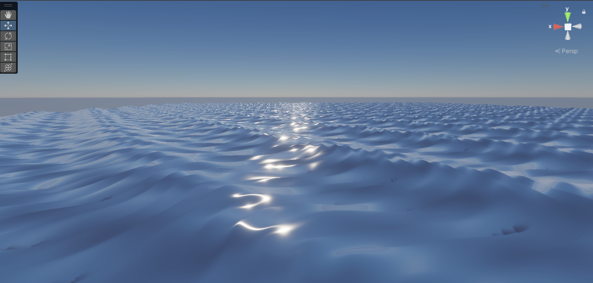
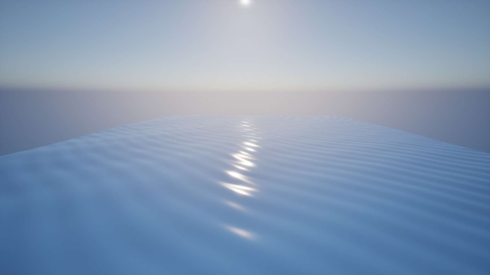
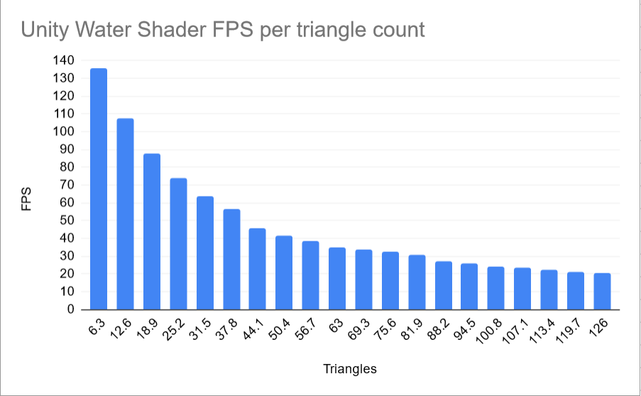
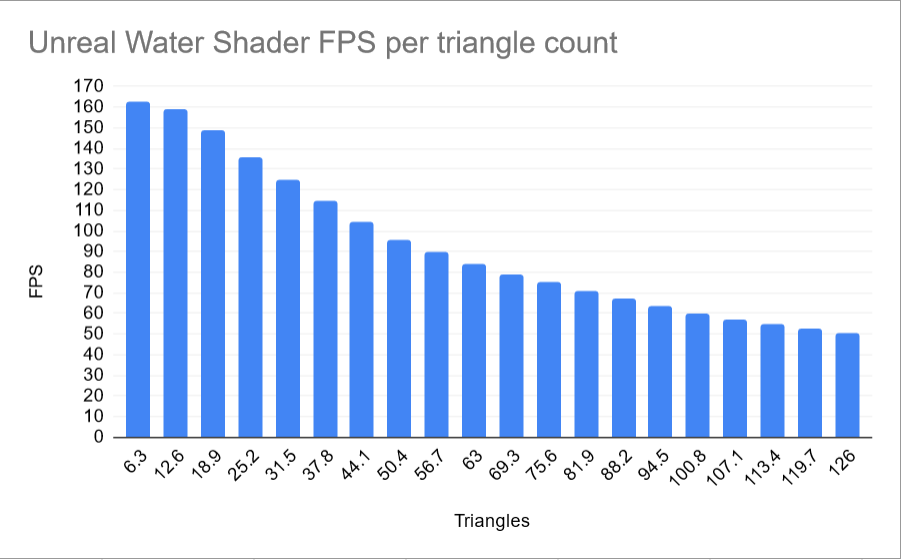

<h1>Water Shader Engine Comparison</h1>
<h2>Water shader implementation</h2>

To create realistic looking waves, I researched common methods used in video games and chose the Gerstner Wave formula, because it is realistic and has enough complexity to make a measurable impact on the performance. I followed a YouTube tutorial to implement it into Unity using Shader Graph. The variables didn’t seem to make an impact on performance, so I tweaked them to my liking. Next, I created the Unreal project and changed the settings to turn off post processing, to match it as close to Unity as possible. My next goal was to create the shader in Unreal which was the most time-consuming part of this assignment, because there were some differences in the material settings, missing functions, different coordinate spaces and difference in the normals.

<h2>Links</h2>
[Inspiration](https://www.youtube.com/watch?v=V4yZigMSLiU)
 
[Unity Tutorial](https://www.youtube.com/watch?v=Awd1hRpLSoI)

<h2>Testing</h2>

I tested the charts using from 1 to 20 planes each of which are ~6 million tris with the shader applied.

